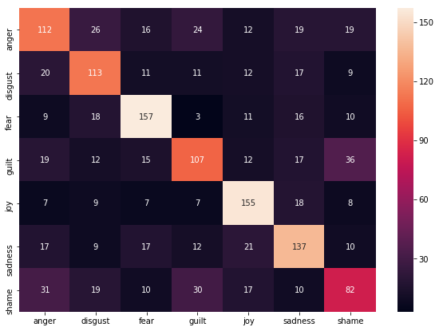

# Emoji Prediction

While texting to your friends, can you tell their emotion? Are they happy? Nowadays, people often send text messages to each other. However, it's difficult for people to understand and know a sender's emotions based on text messages, especially from not close friends. This project tries to build a classifier to predict sentiment associated with a text and represent it as an emoji.

## Quickstart
To use this project, it's required to install python3, jupyter notebook, and some python libraries.

### Install
#### Install python3
If you don't have python3 on your computer, there are two options:
+ Download python3 from [Anaconda](https://www.anaconda.com/download/), which includes Python, Jupyter Notebook, and the other libraries.
+ Download python3 from [python.org](https://www.python.org/downloads/)

#### Install packages
All packages used for this project are written in `requirements.txt`. To install, you can run
```
$ pip3 install -r requirements.txt
```

#### Download project
To download this project repository, you can run
```
$ git clone https://github.com/TetsumichiUmada/text2emoji.git
```

#### Run jupyter notebook
To start jupyter notebook, you move to the directory with `cd path_to/text2emoji`, then run
```
$ jupyter notebook
```
See [Running the Notebook](https://jupyter.readthedocs.io/en/latest/running.html#running) for more details.

## Project Details
The goal of this project is to predict an emoji that is associated with a text message. To accomplish this task, we train and test several supervised machine learning models on a data to predict a sentiment associated with a text message. Then, we represent the predicted sentiment as an emoji.

### Data Sets
The data comes from the [DeepEmoji/data](https://github.com/bfelbo/DeepMoji/tree/master/data) repository. Since the file format is a pickle, we wrote a python 2 script to covert a pickle to a txt file. The data (both pickle and txt files) and scripts are stored in the text2emoji/data directory.

Among the available data on the repository, we use the PsychExp dataset for this project. In the file, there are 7840 samples, and each line contains a text message and its sentimental labels which are represented as a vector `[joy, fear, anger, sadness, disgust, shame, guilt]`.

In the txt file, each line is formatted like below:

```
[ 1.  0.  0.  0.  0.  0.  0.] Passed the last exam.
```

Since the first position of the vector is 1, the text is labeled as a joy.

For more information about the original data sets, please check [DeepEmoji/data](https://github.com/bfelbo/DeepMoji/tree/master/data) and text2emoji/data.


### Preprocess and Features
How does computer understand a text message and analyze its sentiment? A text message is a series of words. To be able to process text messages, we need to convert text into numerical features.

One of the methods to convert a text to numerical features is called an [n-grams](https://en.wikipedia.org/wiki/N-gram). An n-gram is a sequence of n words from a given text. A 2-gram(bigram) is a sequence of two words, for instance, "thank you" or "your project", and a 3-gram(trigram) is a three-word sequence of words like "please work on" or "turn your homework".

For this project, first, we convert all the texts into lower cases. Then, we created n-grams with a range from 1 to 4 and counted each n-gram appears in the text.

### Models and Results
Building a machine learning model involves mainly two steps. The first step is to train a model. Then, we evaluated the model. For this project, we picked four classifiers and train each classier to see which one works better for this project. To train and test the performance of each model, we split the dataset into a training set and test set, in the ratio of 80% and 20%. By separating the data, we can make sure that the model is well generalized and can perform well in the real world.

We evaluate the performance of each model by calculating an accuracy score. The accuracy score is simply the proportion of classifications that were done correctly and is calculated by

$$
\text{Accuracy} = \frac{\text{number of correct classifiers}}{\text{total number of classifications made}}
$$

For this project, we tried following classifiers and their accuracy scores are summarized in the table below.

| Classifier                | Training Accuracy | Test Accuracy |
| ------------------------- | ----------------- | ------------- |
| [SVC](http://scikit-learn.org/stable/modules/generated/sklearn.svm.SVC.html)                       |         0.1458890 |     0.1410428 |
| [LinearSVC](http://scikit-learn.org/stable/modules/generated/sklearn.svm.LinearSVC.html)                 |         0.9988302 |     0.5768717 |
| [RandomForestClassifier](http://scikit-learn.org/stable/modules/generated/sklearn.ensemble.RandomForestClassifier.html)    |         0.9911430 |     0.4304813 |
| [DecisionTreeClassifier](http://scikit-learn.org/stable/modules/generated/sklearn.tree.DecisionTreeClassifier.html)    |         0.9988302 |     0.4585561 |

Based on the accuracy scores, it seems like SVC (support vector machine) classier is working fine, but its accuracy is low. The LinearSVC is working good although the model is overfitting (meaning that the training accuracy is higher and test accuracy is low). We can observe the same phenomena for the other classifiers. By choosing the classifier with the highest accuracy score on the test set, the LinearSVC seems to be good.

### Error Analysis

We analyzed the classification results from the LinearSVC model, using the confusion matrix. A confusion matrix is a table which summarizes the performance of a classification algorithm and shows. It allows to identify confusion between classes (such as one class that is commonly mislabeled as the other) The rows represent the true labels and the columns are predicted labels.



Based on the above table, the classifier tends to misclassify text messages with guilt, shame, and anger. This happens probably because the text does not have any word which characterizes its sentiment. On the other hand, because joy message more likely to have words such as good, like, and happy, the classifier is able to well find out if the given message is happy or not.

### Future Work
To be able to accurately analyze the text, we probably need to have more data to train the classifiers. At the same time, we can more experiment with engineering features. It might work if we use a Chi-squared test to find out more informative tokens. We might also be possible to build a deep learning for the sentimental classification.

### Demo
Using the classifier we built, we tried to predict an emoji that is associated with the test messages.

😂 Thank you for dinner!       
😢 I don't like it          
😱 My car skidded on the wet street        
😢 My cat died       


### Reference
+ [DeepMoji](https://www.media.mit.edu/projects/deepmoji/overview/)
+ [DeepMoji GitHub](https://github.com/bfelbo/DeepMoji)
+ [Multiclass and multilabel algorithms](http://scikit-learn.org/stable/modules/multiclass.html)
+ [sklearn.svm.SVC](http://scikit-learn.org/stable/modules/generated/sklearn.svm.SVC.html)
+ [sklearn.svm.LinearSVC](http://scikit-learn.org/stable/modules/generated/sklearn.svm.LinearSVC.html)
+ [sklearn.ensemble.RandomForestClassifie](http://scikit-learn.org/stable/modules/generated/sklearn.ensemble.RandomForestClassifier.html)
+ [sklearn.tree.DecisionTreeClassifier](http://scikit-learn.org/stable/modules/generated/sklearn.tree.DecisionTreeClassifier.html)
